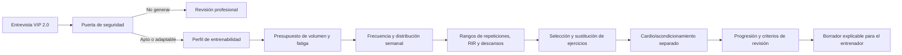

# Auditoría de rutinas para el Motor VIP 2.0

Fecha: 11 de agosto de 2026

Estado: diagnóstico terminado; integración todavía no ejecutada
Privacidad: documento anonimizado. El banco detallado permanece en almacenamiento local ignorado por Git.

## Resultado ejecutivo

Se revisaron 19 PDF y 138 páginas. Hay 18 contenidos únicos porque dos archivos son duplicados exactos.

La colección tiene mucho valor como memoria práctica del entrenador, pero no debe utilizarse como un conjunto de plantillas para copiar. Ninguna rutina cumple por sí sola todos los requisitos de un estándar dorado. La clasificación resultante es:

| Clase | Cantidad | Uso correcto |
|---|---:|---|
| Candidatos base con correcciones | 3 | Inspirar estructura, distribución y presentación |
| Útiles con correcciones mayores | 5 | Extraer ideas parciales y casos de calibración |
| Antipatrones | 9 | Enseñar al motor qué debe bloquear o reducir |
| Solo screening | 1 | Probar el filtro de seguridad; no generar rutina |

## Lo mejor encontrado

1. Algunas rutinas sí declaran perfil, objetivo, prioridades morfológicas, días disponibles, RIR/RPE, descansos y notas técnicas.
2. Hay ejemplos útiles de tres, cuatro, cinco y seis días; de recomposición; de transición a Wellness; y de preparación Classic Physique.
3. Varias versiones incorporan seguimiento de peso, medidas, fotos, sueño y adherencia.
4. La revisión posterior de un mismo caso muestra una mejora real: menos saturación, acondicionamiento separado y sesiones más legibles.
5. La presentación en tablas facilita la ejecución, pero debe ir acompañada de una dosis calculada.

## Problemas repetidos que el nuevo motor debe eliminar

### 1. Demasiado trabajo para el perfil

Se encontraron sesiones con más de treinta series nominales, técnicas FST-7, biseries, drop sets, rest-pause, fallo y cardio añadidos en el mismo día. En otros casos una persona con pocos meses de experiencia recibió cinco días de trabajo de alta densidad.

La actualización de ACSM de 2026 concluye que la hipertrofia mejora con mayor volumen —aproximadamente diez series semanales por grupo como referencia para adultos sanos—, pero también que el fallo, la complejidad y las técnicas avanzadas no son requisitos universales. Esto respalda usar rangos individuales, no convertir diez series en un mínimo rígido ni apilar métodos para que una rutina parezca avanzada.

### 2. Fallo muscular convertido en identidad del programa

Muchas rutinas usan RIR 0-1, “fallo absoluto” o “fallo técnico” de forma global. La evidencia no muestra que entrenar al fallo sea necesario para ganar fuerza o masa; trabajar a 1-2 RIR puede producir hipertrofia similar con menos fatiga aguda. El Motor VIP debe reservar el fallo para situaciones concretas, ejercicios seguros, atletas preparados y una dosis pequeña.

### 3. Pérdida de grasa confundida con agotamiento

Expresiones como “vaciar completamente el glucógeno”, “forzar la oxidación de grasa”, “detonación láctica” o “quemador terminal” aparecen como justificación de circuitos repetidos. No deben transformarse en reglas fisiológicas. La rutina de fuerza protege o desarrolla capacidad y masa muscular; el cardio, los pasos y la nutrición son módulos relacionados, pero separados.

### 4. Falta de cálculo de recuperación

El sistema actual puede ver cinco días disponibles y llenar los cinco. El nuevo motor debe considerar también experiencia, volumen reciente, sueño, estrés, déficit energético, molestias, rendimiento, tiempo por sesión y adherencia. “Puede entrenar” no significa “puede recuperarse”.

### 5. Misma rutina para dos personas

Una dupla puede compartir horario y selección de estaciones, pero necesita dos perfiles. Volumen, carga, RIR, rango de movimiento, sustituciones y progresión deben calcularse individualmente.

### 6. Seguridad incompleta

Uno de los documentos contiene antecedentes como síncope, taquicardia y resistencia a la insulina, pero no una rutina. Es un excelente caso para probar que el generador se detenga. El filtro debe considerar actividad actual, enfermedad diagnosticada, síntomas, intensidad deseada, medicamentos y limitaciones musculoesqueléticas antes de producir una prescripción.

### 7. Nutrición, agua y suplementos mezclados con entrenamiento

Se hallaron metas fijas de 4,5-5 litros de agua, estrategias de diuresis, suplementos y restricciones alimentarias presentadas como obligaciones. Nada de eso debe ser decidido por el Motor de Rutinas. Esos contenidos requieren módulos y competencias independientes.

### 8. Lenguaje fuerte presentado como ciencia

“Milimétrico”, “militar”, “implacable”, “shock” o “élite” pueden ser estilo comunicacional, pero no prueban que una dosis sea correcta. El motor deberá mostrar la razón calculable de cada decisión: objetivo, evidencia del perfil, dosis, progresión y criterio de ajuste.

## Reglas obligatorias propuestas

1. **Puerta de seguridad:** clasificar en `apto`, `apto_con_adaptaciones`, `requiere_revision` o `no_generar` antes de elegir ejercicios.
2. **Datos mínimos:** no generar sin objetivo, experiencia real, frecuencia sostenible, tiempo, equipo, historial reciente, molestias/limitaciones y capacidad de recuperación.
3. **Volumen desde la línea base:** si existe una rutina reciente, partir del volumen tolerado. Si no existe, usar una dosis conservadora y una fase de familiarización.
4. **Presupuesto semanal y por sesión:** calcular series directas e indirectas por grupo muscular y distribuirlas; no contar solamente ejercicios.
5. **Frecuencia como distribución:** usar más días solo cuando mejore adherencia, calidad o reparto de volumen.
6. **Intensidad con RIR/RPE:** el fallo no es el valor por defecto. Los compuestos y perfiles vulnerables conservan mayor margen.
7. **Descansos por demanda:** permitir recuperación suficiente en movimientos multiarticulares; los descansos cortos se reservan para accesorios o metas específicas.
8. **Técnicas avanzadas con permiso:** drop set, rest-pause, FST-7, series gigantes y circuitos requieren nivel, tolerancia, objetivo y un límite de exposición.
9. **Cardio separado:** prescribir modalidad, duración e intensidad por objetivo y tolerancia; no usarlo como castigo post-pesas.
10. **Progresión observable:** aumentar repeticiones o carga cuando se cumple el rango con el RIR objetivo y técnica aceptable; reducir cuando baja rendimiento o recuperación.
11. **Revisión basada en señales:** el deload no es obligatorio cada cuatro semanas para todos; se programa o activa por fatiga, rendimiento, dolor, calendario competitivo y preferencia.
12. **Explicabilidad:** toda rutina debe decir por qué tiene esos días, series, RIR, descansos y ejercicios.
13. **Trazabilidad:** guardar versión, respuestas, reglas aplicadas y cambios hechos por el entrenador.
14. **Control humano:** la primera versión no publica directamente. Genera un borrador y muestra alertas y dudas al entrenador.

## Cómo usar atletas y escuelas de culturismo

Mentzer, Arnold, culturistas actuales y preparadores reconocidos se incorporarán como **biblioteca de métodos**, no como autoridad automática:

- Un enfoque de alta intensidad y bajo volumen puede servir a ciertos atletas, pero no autoriza fallo global.
- Un enfoque de alto volumen puede servir a atletas altamente adaptados, pero no se transfiere a principiantes o personas con recuperación limitada.
- La preparación de un profesional del Olympia está influida por años de entrenamiento, genética, recursos, calendario y factores que no deben extrapolarse a la población general.
- La categoría competitiva define prioridades morfológicas y de presentación; la dosis sigue dependiendo del individuo.

## Diseño propuesto del Motor de Dosis

El próximo proyecto implementará primero de `B` a `G`: seguridad, perfil entrenable y dosis. Todavía no elegirá todos los ejercicios ni publicará una rutina. Esto permite comprobar el corazón del sistema antes de automatizar el resto.

## Criterios para considerar el motor listo

- Rechaza correctamente todos los casos de alarma.
- No asigna técnicas avanzadas a perfiles sin preparación.
- No supera el presupuesto de volumen configurado sin una justificación y revisión.
- Produce dos dosis distintas para dos personas que entrenan juntas.
- Explica todas las decisiones principales.
- Reacciona a falta de sueño, dolor, baja adherencia o caída de rendimiento.
- Supera pruebas con los 18 casos únicos y con casos sintéticos de jóvenes, adultos mayores, discapacidad y atletas competitivos.

## Fuentes técnicas principales

- American College of Sports Medicine. *Resistance Training Prescription for Muscle Function, Hypertrophy, and Physical Performance in Healthy Adults: An Overview of Reviews* (2026): https://pubmed.ncbi.nlm.nih.gov/41843416/
- International Universities Strength and Conditioning Association. *Resistance Training Recommendations to Maximize Muscle Hypertrophy in an Athletic Population* (2021): https://journal.iusca.org/index.php/Journal/article/download/81/140/5323
- National Strength and Conditioning Association. *Resistance Training for Older Adults*: https://www.nsca.com/about-us/position-statements/resistance-training-for-older-adults/
- National Strength and Conditioning Association. *Youth Resistance Training*: https://www.nsca.com/globalassets/about/position-statements/position_stand_youth_resistance_training---2009.pdf
- World Health Organization. *Guidelines on physical activity and sedentary behaviour*: https://www.who.int/publications/i/item/9789240014886
- Grgic et al. *Effects of resistance training performed to repetition failure or non-failure* (2022): https://pubmed.ncbi.nlm.nih.gov/33497853/
- Refalo et al. *Similar muscle hypertrophy following training to failure or with repetitions in reserve* (2024): https://pubmed.ncbi.nlm.nih.gov/38393985/
- ACSM preparticipation screening evidence and algorithm context: https://pubmed.ncbi.nlm.nih.gov/28557860/
